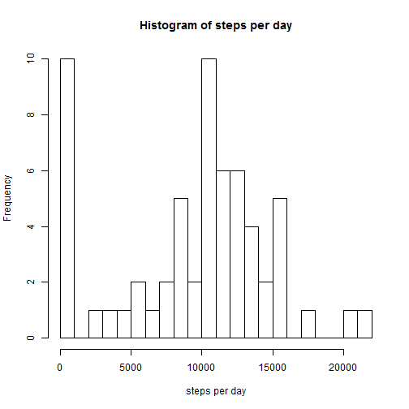
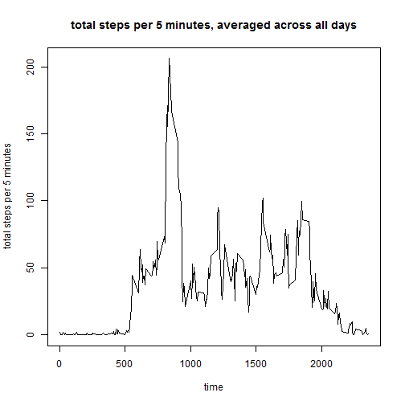
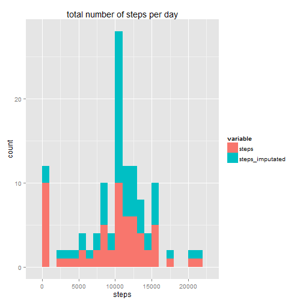
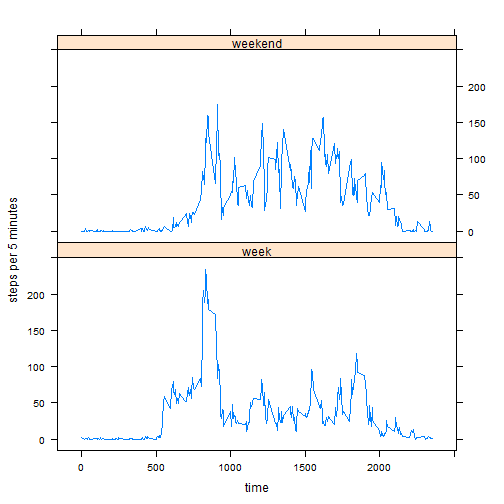

Importing the packages used by the script and setting language to englis

```r
library(dplyr)
library(reshape2)
library(ggplot2)
library(lubridate)
library(lattice)
library(xtable)
```


The data is first loaded.  

```r
filename <- 'activity.csv'
data <- read.csv(filename)
```

##Total steps per day
What is the mean and median of total steps per day?

```r
grouped <- group_by(data, date)
steps_per_day <- summarize(grouped, steps_per_day = sum(steps, na.rm = TRUE))
mean_before_imputation <- mean(steps_per_day$steps_per_day)
median_before_imputation <- median(steps_per_day$steps_per_day)
```
The average total steps per day is 9354.23.  
The median total steps per day is 10395.  

```r
hist(steps_per_day$steps_per_day, breaks = 20, 
     main = 'Histogram of steps per day', 
     xlab = 'steps per day')
```

 

##Average daily activity pattern
Prepare a time series plot of the total of steps per 5 minutes, averaged across all days.

```r
grouped <- group_by(data, interval)
pattern <- summarize(grouped, steps_per_5_min = mean(steps, na.rm = TRUE))
plot(pattern$interval, pattern$steps_per_5_min, type = 'l', 
     xlab = 'time', 
     ylab = 'total steps per 5 minutes', 
     main = 'total steps per 5 minutes, averaged across all days')
```

 

What is the most active moment of the day?

```r
most_active <- order(pattern$steps_per_5_min, decreasing = TRUE)[1]
time_average <- as.character(pattern$interval[most_active])
most_active <- order(data$steps, decreasing = TRUE, na.last = TRUE)[1]
time_all <- as.character(data$interval[most_active])
date_all <- as.character(data$date[most_active])
```
When taking the average across all days, the most active moment of the day is 8:35.  
Over the entire dataset, the most active moment of the day is 6:15 on 2012-11-27.  

##Imputing missing values
The dataset contains many missing values.  These are replaced by the average across all dats for the same 5 minutes interval.  


```r
nb_missing_before <- sum(is.na(data$steps))
data = mutate(data, steps_imputated = steps)
for (index in 1:dim(data)[1]) {
  if (is.na(data[index, 'steps_imputated'])) {
    data[index, 'steps_imputated'] <- pattern[pattern$interval==data[index, 'interval'],'steps_per_5_min']
  }
}
nb_missing_after <- sum(is.na(data$steps_imputated))
```
Number of missing values before imputation: 2304.  
Number of missing values after imputation: 0.  

Are the average and median steps changed by the imputation?

```r
melted <- data.frame(melt(data, id = c('date', 'interval')))
grouped <- group_by(melted, variable, date)
casted <- data.frame(acast(melted, date ~ variable, sum))
mean_after_imputation <- mean(casted$steps_imputated, na.rm = TRUE)
median_after_imputation <- median(casted$steps_imputated, na.rm = TRUE)
```
The mean changed slightly (from 9354.23 to 10766.19).    
The median also changed slightly (from 10395 to 10766.19).    
Lets compare the effects of the imputation on the histogram of total steps per day. 

```r
for_graph <- summarize(grouped, steps = sum(value, na.rm = TRUE))
q <- qplot(steps, data = for_graph, fill = variable, binwidth = 1000)
q <- q + labs(title = 'total number of steps per day')
print(q)
```

 

#Week activity VS weekend activity
Is the pattern of steps different during the week and the weekend?

```r
data$date <- ymd(data$date)
data <- mutate(data, weekday = weekdays(date))
data <- mutate(data, week_weekend = '')
for (index in 1:dim(data)[1]) {
  if (data[index, 'weekday'] %in% c('Saturday', 'Sunday')) {
    data[index, 'week_weekend'] <- 'weekend'}
  else data[index, 'week_weekend'] <- 'week'
}
grouped <- group_by(data, interval, week_weekend)
pattern <- summarize(grouped, steps_per_5_min = mean(steps, na.rm = TRUE))
pattern$week_weekend <- as.factor(pattern$week_weekend)
xyplot(pattern$steps_per_5_min ~ pattern$interval | pattern$week_weekend, 
       layout = c(1,2), type = 'l', 
       xlab = 'time', ylab = 'steps per 5 minutes')
```

 

A weekday mornings start earlier and include more steps and a higher peak of steps.  
However, weekdays display less steps during the day.  The number of steps during a weekend is more evenly distributed.  
